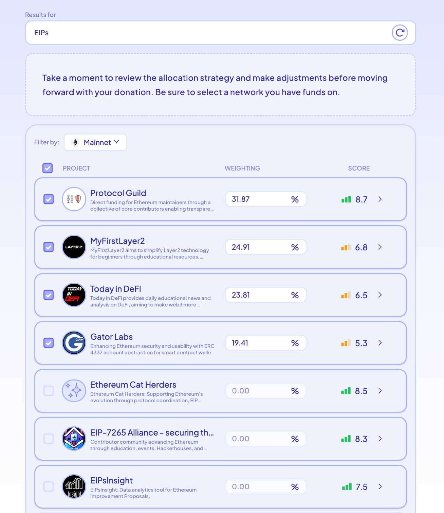

# evo.sage

---

[Discord](https://discord.gg/k7UCsH3ps9) | [Website](https://fundpublicgoods.ai) | :star: the repo !  

---

## Welcome!

evo.sage is an agent that specializes in streamlining resource allocation. Try it now at [fundpublicgoods.ai](https://fundpublicgoods.ai)

## Need Help?

Join our [Discord community](https://discord.gg/k7UCsH3ps9) for support and discussions.

If you have questions or encounter issues, please don't hesitate to [create a new issue](https://github.com/polywrap/evo.sage/issues/new) to get support.

## How it works

evo.sage is designed to generate funding allocation strategies based on the user's preferences and publicly available data. In its first implementation, it focuses on how to best allocate funds to Public Good Projects (PGPs) that were apart of past [GitCoin](https://www.gitcoin.co/) rounds.

Digging a bit deeper, here are the steps the agent takes when creating an allocation strategy:

1. **Find Relevant Projects.** Perform a vector similarity search across project data from all past Gitcoin rounds. Aggregate the results, filter out duplicates, and rerank the results based on the original prompt to arrive at the top ten. *Techniques used: [Similarity Search](https://www.pinecone.io/learn/what-is-similarity-search/), [LLM-based Reranking](https://medium.com/@foadmk/enhancing-data-retrieval-with-vector-databases-and-gpt-3-5-reranking-c58ec6061bde)*

2. **Generate Holistic Evaluations.** Generate a comprehensive report for each project that breaks down its a) relevance, b) impact, and c) funding needs. *Techniques used: [Generated Knowledge Prompting](https://www.promptingguide.ai/techniques/knowledge), [Zero-Shot Prompting](https://www.promptingguide.ai/techniques/zeroshot), Summarization*

3. **Compute Evaluation Scores.** Analyze each report and assign a numerical evaluation score from 0-10 for each of the three criteria. Combine these scores through a weighted average to arrive at the project’s overall score. Weight the allocation percentages in proportion to scores of the projects with addresses on the selected chain. *Techniques used: [RAG](https://www.promptingguide.ai/techniques/rag), Numerical Evaluations, Algorithmic Composition*

The allocation strategy includes a report for each project summarizing the agent’s findings. 

One critical aspect of the report is the impact section. The agent uses information from the project’s Gitcoin round applications to arrive at an intelligent estimate of the impact that a project has had.

Another unique aspect of the report is that it estimates each project’s funding needs based on information like prior funding and team size. This help gives context on the project’s past funding sources, such as venture backing or grants.

An important limitation to note is that this version of the agent only uses self-reported data from projects. But future versions could use a variety of on- and off-chain data from third parties.
